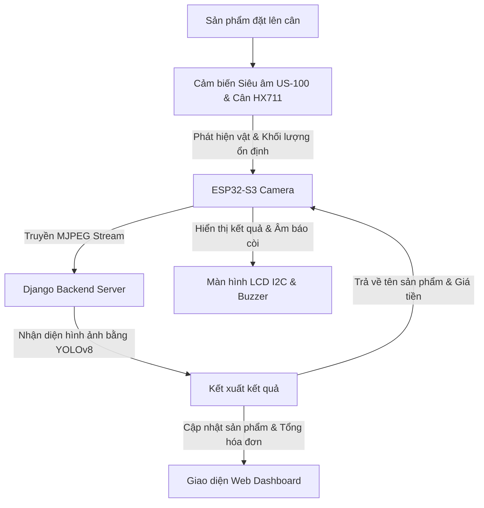

# Hệ Thống Thanh Toán Thông Minh Tự Động - AutoBill System

Hệ thống **AutoBill** là giải pháp POS (Point of Sale) thông minh, kết hợp giữa phần cứng nhúng (ESP32-S3 Camera, Cân điện tử HX711, Cảm biến siêu âm US-100) và trí tuệ nhân tạo (YOLOv8) để tự động nhận diện và tính tiền sản phẩm dựa trên hình ảnh và cân nặng thời gian thực.

---

## 📌 Sơ Đồ Kiến Trúc Hệ Thống



---

## 📂 Cấu Trúc Thư Mục Dự Án

Dưới đây là cấu trúc chi tiết của toàn bộ dự án:

```text
App/
├── codekethop.ino            # Mã nguồn chính cho vi điều khiển ESP32-S3 Cam
├── requirements.txt          # Khai báo thư viện Python cần thiết cho Backend
└── autobill_system/          # Thư mục chứa dự án Django Backend
    ├── manage.py             # Script quản lý chính của Django
    ├── db.sqlite3            # Cơ sở dữ liệu SQLite3 lưu hóa đơn và sản phẩm
    ├── autobill_system/      # Thư mục cấu hình cốt lõi dự án Django
    │   ├── settings.py       # Thiết lập dự án Django (CSDL, Static, Media...)
    │   ├── urls.py           # Định tuyến URL tổng
    │   └── wsgi.py
    ├── model/                # Thư mục chứa mô hình AI YOLOv8
    │   └── best.pt           # File trọng số mô hình YOLOv8 đã train
    ├── store/                # Django App quản lý bán hàng và tích hợp phần cứng
    │   ├── admin.py          # Đăng ký admin quản lý CSDL
    │   ├── models.py         # Định nghĩa bảng Invoice và InvoiceItem
    │   ├── urls.py           # Các API phần cứng và Web Dashboard
    │   └── views.py          # Logic xử lý API, Live Stream, Nhận diện AI
    └── templates/            # Thư mục chứa giao diện HTML
        ├── dashboard.html    # Giao diện Web Dashboard chính cho quầy thanh toán
        └── test_upload.html  # Giao diện kiểm thử tải ảnh lên thủ công
```

---

## ⚙️ Chi Tiết Chức Năng Các Thành Phần

### 1. Vi điều khiển nhúng & Cảm biến (`codekethop.ino`)
Đóng vai trò làm trạm thu thập thông tin và tương tác vật lý trực tiếp với khách hàng tại quầy.
* **Cảm biến Siêu âm US-100**: Phát hiện sự hiện diện của vật thể trong khoảng cách `< 15 cm` để kích hoạt quá trình cân đo.
* **Cảm biến cân HX711**: Đo khối lượng liên tục với bộ lọc EMA (Exponential Moving Average) để khử nhiễu.
* **Camera ESP32-S3**: Phát luồng MJPEG chất lượng cao qua cổng `81` tại endpoint `/stream` để server lấy dữ liệu ảnh.
* **Đèn LED RGB & Còi Buzzer**:
  - LED Xanh lá: Chế độ nhận diện hoạt động bình thường.
  - LED Đỏ: Báo lỗi hoặc Hệ thống bị khóa (`LOCKED`).
  - LED Xanh dương: Đang khởi động hệ thống.
  - Buzzer phát các tiếng Beep ngắn/dài biểu thị trạng thái tương tác thành công hoặc lỗi.
* **Màn hình LCD 1602 (I2C)**: Hiển thị khối lượng thời gian thực, tên sản phẩm, giá tiền và các cảnh báo hệ thống.

### 2. Django Backend & YOLOv8 AI (`autobill_system`)
Xử lý dữ liệu luồng ảnh từ camera và tính toán hóa đơn.
* **Load Model YOLOv8**: Tự động load file trọng số `best.pt` nằm trong thư mục `model/` để phân tích ảnh.
* **API Nhận diện `/predict`**: Nhận yêu cầu từ ESP32, kết nối tới luồng stream camera lấy frame ảnh thực tế, resize về `640x640`, chạy mô hình YOLOv8 để định danh sản phẩm, lưu thông tin sản phẩm và ảnh chụp nhận dạng vào cơ sở dữ liệu.
* **API Quản lý phiên `/session/status`**: Cung cấp trạng thái của hóa đơn hiện tại (Đang hoạt động - `active`, Bị khóa - `locked`, Số lần quét lại - `rescan_count`) cho thiết bị phần cứng đồng bộ hóa.

### 3. Giao diện Web Dashboard (`dashboard.html`)
Giao diện hiển thị cao cấp chuẩn POS, hỗ trợ tối ưu thiết bị di động, tự động cập nhật giỏ hàng theo thời gian thực (Polling mỗi 1.5 giây).
* **Bắt đầu hóa đơn**: Khởi tạo phiên thanh toán mới, giải phóng khóa thiết bị phần cứng.
* **Quản lý giỏ hàng**: Hiển thị tên sản phẩm, mã SP, khối lượng, đơn giá và tổng số tiền của khách hàng.
* **Hành động Quét lại (Rescan)**: Cho phép xóa sản phẩm lỗi và ra lệnh cho cân quét lại tự động.
* **Hoàn tất thanh toán**: Lưu đóng hóa đơn hiện tại để bắt đầu phiên tiếp theo.

---

## 🔄 Luồng Logic Các Trạng Thái Thiết Bị (State Machine)

ESP32 chạy một máy trạng thái (State Machine) cực kỳ chặt chẽ bao gồm 6 trạng thái để quản lý thiết bị:

1. **`IDLE` (Chờ sản phẩm)**: Đèn LED nhấp nháy xanh dương nhẹ. Định kỳ 2 giây kiểm tra trạng thái phiên trên Web. Nếu phát hiện bị khóa chuyển ngay sang trạng thái `LOCKED`. Khi phát hiện đồng thời siêu âm (`dist < 15cm`) và cân nặng (`weight > 5g`), chuyển sang `WEIGHING`.
2. **`WEIGHING` (Đang cân)**: Hiển thị khối lượng tăng dần trên LCD. Nếu vật bị nhấc ra, quay về `IDLE`. Khi khối lượng biến động nhỏ hơn `5g` liên tục 6 lần quét, xác định cân đã ổn định và chuyển sang `STABLE`.
3. **`STABLE` (Khối lượng ổn định)**: Kêu 2 tiếng beep ngắn báo hiệu khối lượng đã chốt. Gọi API `/session/status` kiểm tra phiên. Nếu phiên chưa bật, báo lỗi LCD và quay về `WEIGHING`. Nếu phiên bị khóa, chuyển sang `LOCKED`. Nếu mọi thứ bình thường, chuyển sang `SENDING`.
4. **`SENDING` (Đang gửi dữ liệu)**: Bật LED Vàng. Gửi yêu cầu gồm cân nặng và IP Camera lên API `/predict` của máy chủ.
   - *Nếu thành công*: Hiển thị tên sản phẩm và tiền bằng VNĐ trên LCD, còi kêu 3 tiếng beep báo nhận diện thành công, gọi API cập nhật lại mốc `rescan_count` hiện tại và chuyển sang `RESULT`.
   - *Nếu lỗi*: Bật LED Đỏ, kêu beep dài báo lỗi kết nối, hiển thị `"Server Error"`, tự động chuyển về `WEIGHING` để chuẩn bị cân lại.
5. **`RESULT` (Đã có kết quả)**: Giữ thông tin sản phẩm trên màn hình LCD. Nếu vật được nhấc ra khỏi cân, tắt LED và quay lại `IDLE`. **Đặc biệt**: Định kỳ kiểm tra API, nếu phát hiện người dùng bấm nút **"Quét lại"** trên Web Dashboard (tức `rescan_count` tăng), còi kêu 1 tiếng beep ngắn báo hiệu và thiết bị tự quay lại trạng thái `WEIGHING` để cân và chụp ảnh nhận diện lại mà không cần nhấc vật ra khỏi cân!
6. **`LOCKED` (Bị khóa hệ thống)**: Xảy ra khi người dùng quét lại quá 3 lần lỗi. Màn hình báo `"HE THONG KHOA"`, còi dừng hoạt động và bật LED **ĐỎ**. Định kỳ kiểm tra API, nếu nhân viên nhấn nút "Bắt đầu hóa đơn mới" trên Web Dashboard để mở khóa, thiết bị tự động tắt LED đỏ và quay lại trạng thái chờ `IDLE`.

---

## 🚀 Hướng Dẫn Vận Hành

### Bước 1: Khởi động Django Backend
1. Di chuyển vào thư mục dự án Django:
   ```bash
   cd autobill_system
   ```
2. Cài đặt các thư viện phụ thuộc:
   ```bash
   pip install -r ../requirements.txt
   ```
3. Khởi chạy Django server trên cổng `8000` (được cấu hình lắng nghe mọi IP trong mạng LAN):
   ```bash
   python manage.py runserver 0.0.0.0:8000
   ```

### Bước 2: Thiết lập & Nạp Code ESP32
1. Mở file `codekethop.ino` bằng Arduino IDE.
2. Kiểm tra các định nghĩa chân (Pins) của cảm biến siêu âm, HX711, LCD I2C, còi buzzer và LED RGB đã đúng với bo mạch thực tế.
3. Thay đổi thông tin mạng WiFi của bạn ở dòng 19 và 20:
   ```cpp
   const char* WIFI_SSID = "Tên_WiFi_Của_Bạn";
   const char* WIFI_PASS = "Mật_Khẩu_WiFi";
   ```
4. Đảm bảo địa chỉ IP ở các hằng số URL khớp với IP máy tính chạy Django Server của bạn (ví dụ `192.168.1.23`):
   ```cpp
   const char* SERVER_URL = "http://192.168.1.23:8000/predict";
   const char* SESSION_URL = "http://192.168.1.23:8000/session/status";
   ```
5. Chọn đúng Board: `ESP32S3 Dev Module` (Hãy bật chức năng PSRAM lên: `Tools` -> `PSRAM` -> `OPI PSRAM`).
6. Biên dịch và nạp code xuống kit ESP32-S3.

### Bước 3: Trải nghiệm hệ thống
Mở trình duyệt trên máy tính hoặc điện thoại truy cập vào địa chỉ: `http://localhost:8000` (hoặc `http://<IP_Server>:8000`) để bắt đầu hóa đơn và đặt sản phẩm lên cân để kiểm nghiệm.
